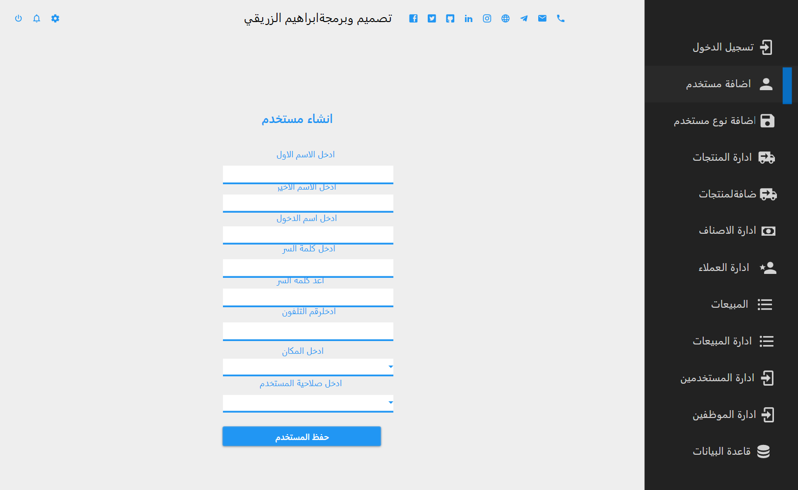
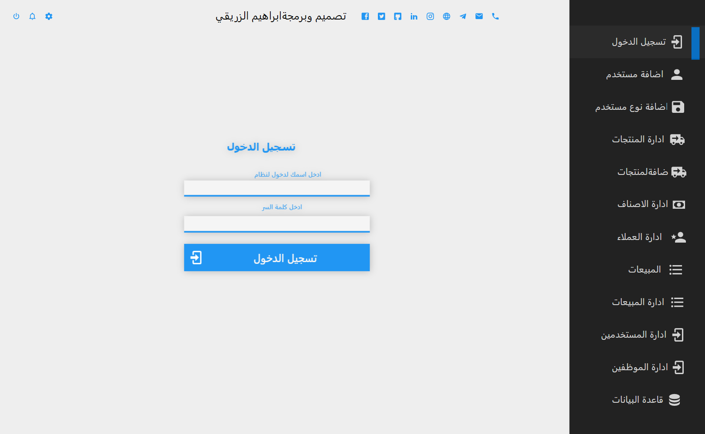
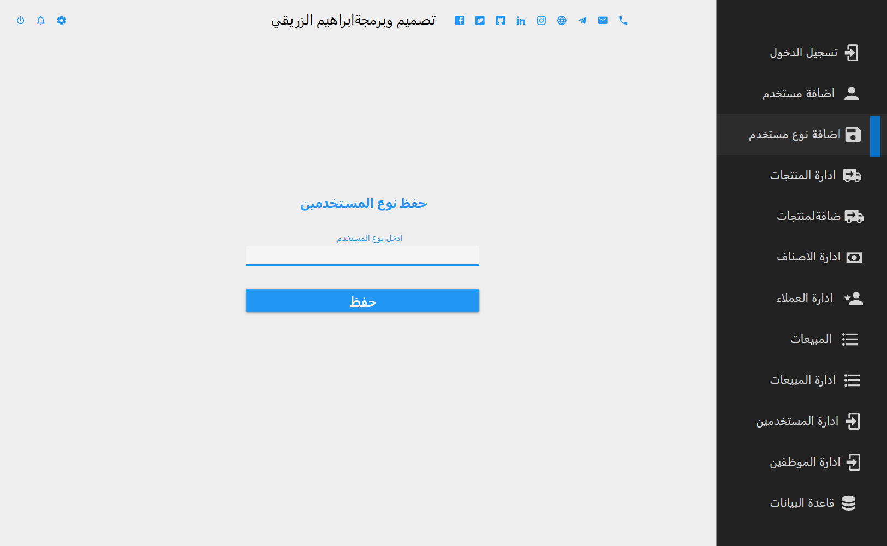
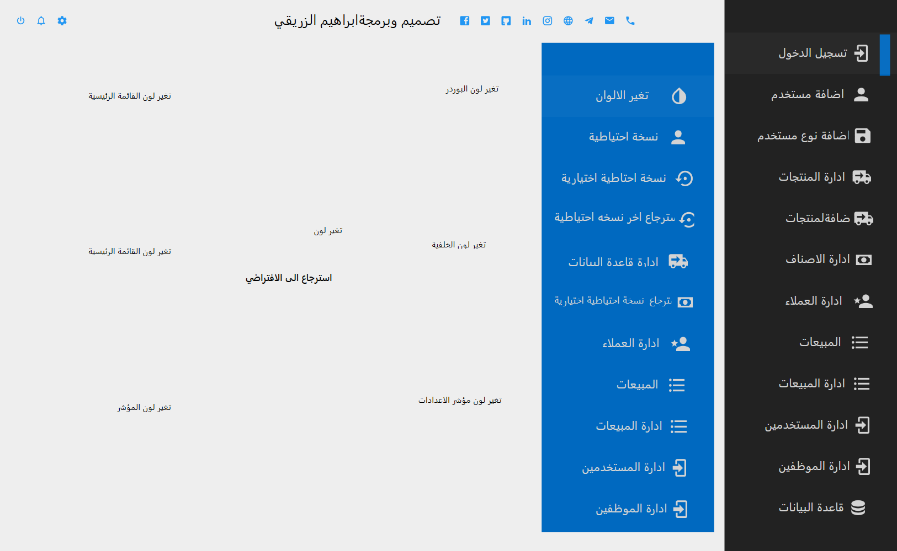

<body style="direction: rtl; dir=rtl;">
<h1 >
    حول النظام
</h1>
  
    نظام إدارة المبيعات حيث يقوم هذا النظام بأدارة المبيعات للمحلات الصغيرة ويقوم النظام بالعمليات التالية
      
    1-اضافة مستخدمين
      
    2- تسجيل الدخول 
      
    3-اضافة منتجات
      
    4-عرض المنتجات
      
    5-عرض تقارير البيع
      
    6-أدارة المستخدمين
      
    7-ادارة العملاء
      
    8-أضافة وأدارة الاصناف
      
    9- عمل نسخه احتياطيه تلقائيه عند كل عملية فتح البرنامج
      
    10-عمل نسخه احتياطبه يديوياً 
      
    11-استرجاع اخر نسخه احتياطيه 
      
    12-استرجاع اي نسخه احتياطيه
    13-تغير الثيم 
      

<h1 >
   About the system
</h1>

Sales management system, where this system manages sales for small shops and the system performs the following operations
      
     1- Add users
      
     2- Sign in
      
     3- Add products
      
     4- Products display
      
     5- View sales reports
      
     6- User management
      
     7- Customer management
      
     8- Add and manage items
      
     9- Make an automatic backup copy every time you open the program
      
      
     10- Make a backup copy manually
      
     11- Restore the last backup copy
      
     12- Restore any backup copy
      
     13-Change the theme
      
       
        
         
     

    
    

      
    

    
      

        
      

    
      

        

    
      

    </body>
